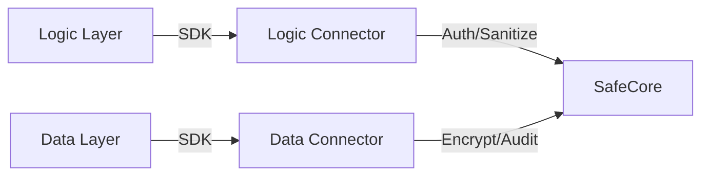

# Daniel_AI SafeCore Architecture

## High-Level Architecture Diagram

```mermaid
graph TD
    subgraph Clients
        App[Application]
        Ext[External Service]
    end

    subgraph Integration_Layer [Integration Layer (Sidecar/Service Mesh)]
        mTLS_GW[mTLS Gateway]
        Auth_Check[Auth Check]
    end

    subgraph SafeCore [Daniel_AI SafeCore]
        Orch[Layer Orchestrator]
        
        subgraph Security_Modules
            IAM[IAM & Zero Trust]
            KMS[Encryption & Key Mgmt]
            Purifier[AI Purifier]
        end
        
        Auditor[Immutable Auditor]
    end

    App -->|mTLS| mTLS_GW
    Ext -->|mTLS| mTLS_GW
    mTLS_GW --> Auth_Check
    Auth_Check --> Orch
    
    Orch --> IAM
    Orch --> Purifier
    Orch --> KMS
    
    IAM -.->|Audit Log| Auditor
    KMS -.->|Audit Log| Auditor
    Purifier -.->|Audit Log| Auditor
    Orch -.->|Audit Log| Auditor
```

## Integration Mandates

### 1. Sidecar / Service Mesh Model
All interactions with Daniel_AI SafeCore MUST occur through a designated sidecar proxy or service mesh (e.g., Istio, Envoy).
- **Decoupling**: Business logic services must not directly implement SafeCore internal logic; they rely on the sidecar for security enforcement.
- **Traffic Interception**: The sidecar intercepts all ingress/egress traffic to enforce mTLS and policy checks.

### 2. mTLS (Mutual TLS)
- **Strict Enforcement**: All communication between the Application layers and SafeCore, as well as between SafeCore modules, MUST use mTLS.
- **Certificate Management**: Automated rotation and revocation of certificates managed by the PKI infrastructure.

## Core Module Definitions

### 1. IAM & Zero Trust
- **Responsibility**: Manages identity verification, session management, and granular access control.
- **Zero Trust**: "Never trust, always verify." Every request is authenticated and authorized in real-time.

### 2. Encryption & Key Management
- **Responsibility**: Centralized handling of cryptographic keys (KMS) and encryption operations.
- **Standards**: AES-256 for data at rest, TLS 1.3+ for data in transit. FIPS 140-2 compliance where applicable.

### 3. Immutable Auditor
- **Responsibility**: Provides a write-once, read-many (WORM) storage for audit logs.
- **Features**:
    - **Forensic Logs**: detailed metadata for every transaction.
    - **Tamper-Evident**: Uses cryptographic hashing (blockchain-like chaining) to ensure log integrity.
    - **Audit API**: Read-only API for compliance auditors.

### 4. AI Purifier
- **Responsibility**: Sanitizes inputs and outputs to prevent injection attacks, data leakage (DLP), and model poisoning.
- **Mechanism**: Real-time AI analysis of payload content before processing by core logic.

## Pluggable Layer Integration

Daniel_AI SafeCore enforces a "Plug-and-Play" security model for the Data and Logic layers via the SDK.

### 1. Data Layer Integration
- **Mechanism**: `DataLayerConnector`
- **Workflow**: 
    - The Data Layer imports the SDK.
    - All writes pass through `protect_and_store()` (Auto-Encryption + Audit).
    - All reads pass through `retrieve_and_expose()` (Decryption + Access Log).

### 2. Logic Layer Integration
- **Mechanism**: `LogicLayerConnector`
- **Workflow**:
    - The Logic Layer imports the SDK.
    - `enforce_security_boundary()` is called at the start of every controller/function.
    - `sanitize_input()` is used to scrub data before processing.


